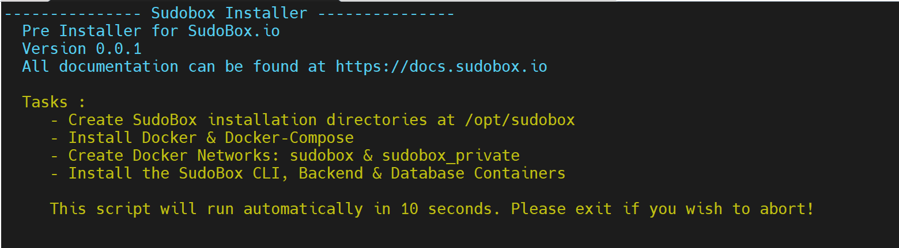

# SudoBox Installer

### Minimum Specs and Requirements
<ol>
<li>Stable: Ubuntu 18/20/21 or Debian 9/10/11</li>
<li>CPU 2 Cores or 2 VCores</li>
<li>4GB Ram</li>
<li>20GB Disk Space</li>
<li>A VPS/VM or Dedicated Server</li>
<li>your Domain or buy a new namecheap</li>
<li>Cloudflare account free tier</li>
</ol>

### PRE INSTALLATION 
To Begin your journey with Sudobox.io and execute the installation process you can run the command below :

``` curl -fsSl https://raw.githubusercontent.com/sudobox-io/sb-install/master/install.sh | sudo bash ```



### NOTICE 
Sudobox is still currently under development and all documentation,images & code are subject to change. 

### Support 
Looking for more inforamtion please visit our docs <a href="https://docs.sudobox.io">https://docs.sudobox.io</a>
If you are looking for help our discord and Forum members are ready to lend a Hand..  <a href="https://sudobox.io">Sudobox</a>
